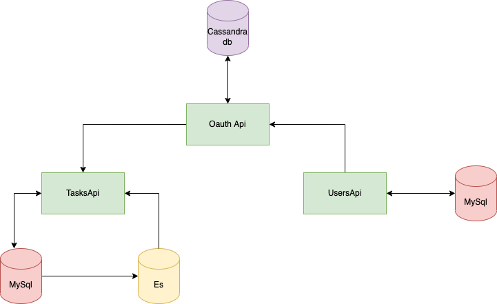

# taskmanagement_microservices
 1. all servoces have been added as a submodule to repo.
 2. To run it locally go git clone of repo and git submodule init and git submodule update 
 3. Note For OauthApi Cassandra db is used which won't work on M1 Macs instead download docker desktop and do a docker pull cassandra and run the image to get cassandra db up and running.
4. Utils repo consists of logger built using uber zap and common error handling for services

